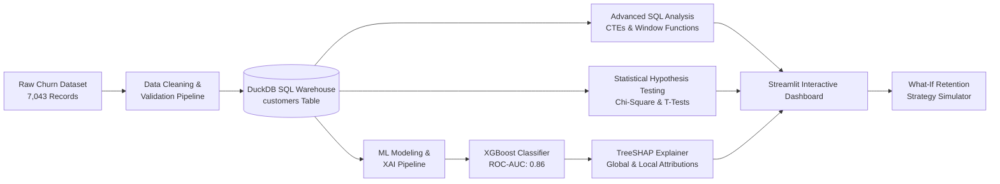

# 🎯 Customer Churn Intelligence & Explainable AI (XAI) Dashboard

[](https://www.python.org/)
[](https://duckdb.org/)
[](https://scikit-learn.org/)
[-red.svg)](https://shap.readthedocs.io/)
[](https://streamlit.io/)
[](LICENSE)

An end-to-end data analytics and predictive intelligence platform designed to diagnose subscription customer churn, quantify Monthly Recurring Revenue (MRR) at risk, explain individual customer attrition drivers with **SHAP (Shapley Additive exPlanations)**, and simulate targeted retention strategies with financial ROI calculations.

---

## 📌 Executive Summary & Key Findings

Analyzing **7,043 customer accounts** representing over **$456,000 in Monthly Recurring Revenue (MRR)** revealed the following core business insights:

* **Revenue at Risk:** The overall churn rate is **26.5%**, representing **$139,130/month ($1.67M annually)** in lost recurring revenue.
* **Contract Risk Disparity:** Customers on **Month-to-Month contracts exhibit a 42.7% churn rate**, compared to **11.3% for 1-Year contracts** and only **2.8% for 2-Year contracts**.
* **Year 1 Vulnerability:** Over **47% of all customer churn occurs within the first 12 months** of tenure.
* **Payment Friction:** Customers paying via **Electronic Check** churn at **45.3%**, nearly 3x higher than automated payment methods (Bank Transfer / Credit Card autopay at ~15%).
* **Service Protection Multiplier:** Customers with **Tech Support + Online Security** packages have an **81% lower churn rate** than customers with no protection add-ons.

---

## 🏗️ Architecture & Data Pipeline



---

## 🚀 Key Features

### 1. 🗄️ Relational SQL Analytics (DuckDB)
* Ingests structured customer tables into an analytical column-store database.
* Features modular SQL scripts demonstrating **CTEs, Window Functions (`DENSE_RANK()`, `SUM() OVER()`), and cohort aggregations**.
* Interactive SQL console in the dashboard allowing live query execution.

### 2. 🔬 Statistical Hypothesis Testing
* **Chi-Square Test of Independence:** Mathematically validates correlation between churn and categorical attributes ($p < 0.001$ for Contract, Tech Support, Internet Service).
* **Two-Sample Welch's T-Test:** Confirms statistically significant differences in Monthly Charges and Customer Tenure between retained and churned cohorts.

### 3. 🧠 Machine Learning & Explainable AI (SHAP)
* Benchmarks **Logistic Regression**, **Random Forest**, and **XGBoost** on stratified test sets.
* Evaluates using **ROC-AUC (0.86)**, **Precision-Recall AUC**, and Confusion Matrices.
* Integrates **TreeSHAP** to solve the machine learning "black box" problem:
  - **Global Explainability:** Ranks top macro drivers of customer attrition.
  - **Local Explainability:** Generates personalized **SHAP waterfall/force attribution charts** explaining why *Customer #X* was assigned a specific risk score.

### 4. 💡 "What-If" Retention Strategy & Financial ROI Simulator
* Allows customer success teams to simulate interventions on high-risk accounts:
  - Upgrading to a 1-year or 2-year contract.
  - Adding complimentary Tech Support.
  - Switching to automated payment methods.
  - Offering a monthly retention discount (e.g., 10%–20%).
* Dynamically recalculates the customer's predicted risk score and projects the **net annual revenue saved after accounting for discount costs**.

---

## 📊 Dataset Reference

This project utilizes the industry-standard **[Telco Customer Churn Dataset](https://www.kaggle.com/datasets/blastchar/telco-customer-churn)** (IBM Business Analytics Benchmark). It contains **7,043 customer accounts** with 21 features covering demographics, subscription services, contracts, billing types, and retention status.

---

## 📂 Project Directory Structure

```
.
├── app/
│   └── main.py                     # Streamlit multi-tab executive dashboard
├── data/
│   ├── raw/                        # Raw dataset storage
│   └── processed/                  # Cleaned CSV & DuckDB analytical warehouse
├── models/                         # Saved ML models, encoders, and SHAP artifacts
├── notebooks/
│   └── 01_churn_deep_dive_eda.ipynb # Documented Jupyter Notebook for EDA & analysis
├── sql/
│   ├── 01_schema_and_ingestion.sql # Database DDL schema
│   ├── 02_kpi_and_cohort_analysis.sql # Advanced SQL queries (CTEs, Window Functions)
│   └── 03_feature_engineering.sql  # SQL views for analytical modeling
├── src/
│   ├── data_loader.py              # Ingestion, cleaning, and DuckDB setup
│   ├── eda_analysis.py             # Statistical tests & exploratory analysis
│   ├── churn_model.py              # ML training, benchmark & SHAP explainability
│   └── retention_strategy.py       # What-If simulation and financial ROI engine
├── tests/
│   └── test_pipeline.py            # Automated end-to-end test suite
├── requirements.txt                # Python package dependencies
└── README.md                       # Project documentation
```

---

## ⚡ Quickstart Guide (Run Locally)

### 1. Clone the Repository
```bash
git clone https://github.com/your-username/Customer-Churn-Intelligence-Explainable-AI-XAI-Dashboard.git
cd Customer-Churn-Intelligence-Explainable-AI-XAI-Dashboard
```

### 2. Set Up Python Virtual Environment (`venv`)
```bash
# Windows
python -m venv venv
.\venv\Scripts\activate

# macOS / Linux
python3 -m venv venv
source venv/bin/activate
```

### 3. Install Dependencies
```bash
pip install -r requirements.txt
```

### 4. Run Data & Machine Learning Pipeline
```bash
# Ingest data into DuckDB database
python src/data_loader.py

# Run statistical EDA tests
python src/eda_analysis.py

# Train ML models and generate SHAP explainability artifacts
python src/churn_model.py
```

### 5. Launch the Streamlit Dashboard
```bash
streamlit run app/main.py
```
Open your browser at `http://localhost:8501`.

---

## 🧪 Running Automated Tests

Run the test suite with `pytest`:
```bash
pytest tests/test_pipeline.py -v
```

---

## 📜 License
This project is licensed under the MIT License - see the [LICENSE](LICENSE) file for details.

